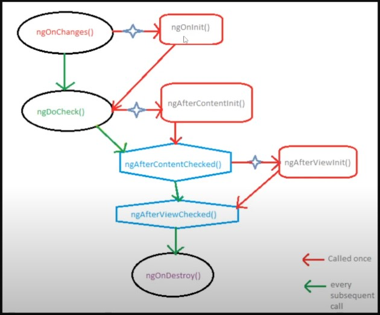
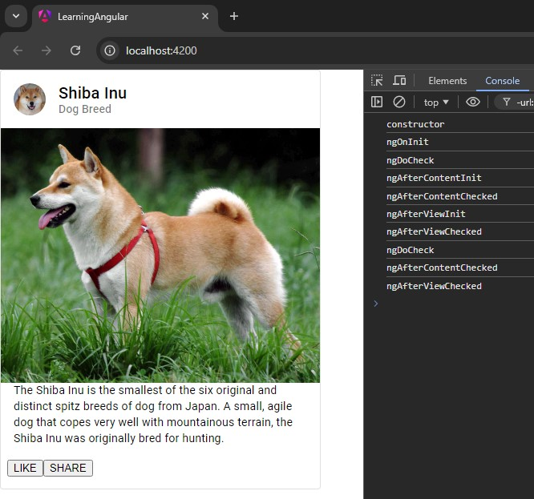

## Indice
1. [Struttura Cartelle](#cartelle-file)
2. [Src](#src)
3. [Creare Componente](#creare-componente)
4. [Class Component](#class-component-typescript)
5. [Ciclo di vita componente](#CICLO-DI-VITA-COMPONENTE)
6. [Data Binding](#data-binding-)
7. [Direttive](#direttive)
8. [Parent to Child (prop)](#parent-to-child-prop)
9. [Child to parent](#child-to-parent)
10. [Variabile Template / ViewChild() ElementRef](#variabile-template--viewchild-riferimento-elementi-html)
11. [Direttive personalizzate](#direttive-personalizzate)
12. [Pipes](#pipes)
13. [Services (Context)](#services-context)
14. [Routing](#routing)
15. [Router Params ](#router-params-)
16. [Children route](#children-route)
17. [Redirect](#redirect)
18. [Error Handling](#error-handling)
19. [Navigate](#navigate)
20. [Lazy Loading](#lazy-loading)
21. [Protected Route (AuthGuard)](#protected-route-authguard)
22. [Guard](#guard---angular-15)
23. [Observable](#observable)
24. [FORM - Template Driven (Gestione HTML)](#template-driven-from-gestione-lato-html)
25. [FORM - Reactive](#reactive-form-gestione-lato-ts)
26. [Modulo HTTP](#modulo-http)
27. [Mapping Data](#mapping-data)
28. [RxJS](#rxjs---reactive-extensions-library-for-javascript)

***

# CARTELLE FILE

- .browserlistrc = contiene tutte le info sui browser e su come l'app viene buildata in ogni motore specifico
- .editorconfig = contiene info e regole sull'editor e sullo stile effettivo del codice del progetto
- .gitignore = tutti i file che non saranno caricati su git
- angular.json = contiene una serie di dati relativi ad angular
- karma.conf.js = Karma, come jasmine, serve per poter testare la nostra app e per il debugging
- package-lock.json = contiene i dati relativi ai dati di node_modules
- package.json = contiene dati e dettagli relativi al progetto e le sue dipendenze
- tsconfig.app.json = configurazione per la produzione, punta ai file che servono
- tsconfig.json = sono informazioni per il compilatore
- tsconfig.spec.json = configurazione per il testing, punta ai file che servono

***

# SRC

- APP
    - app-routing.module.ts / app.routes.ts = file che gestisce il routing 
    - app.component.html = struttura componente 
    - app.component.css = stile componente
    - app.component.ts = specifiche del componente stesso e configurazione, contiene path sia della struttura del componente
    che dello stile che verranno importati, contiene il decoratore e la classe stessa del componente

- ENVIRONMENT (deprecata?)
    - environment.prod.ts = contiene variabili di ambiente per la produzione
    - environment.ts = contiene variabili di ambiente per l'app finale
    - index.html = file html primario <app-root> è il componente globale gestito da angular
    - main.ts = file iniziale del progetto angular

***

# CREARE COMPONENTE
Questo comando permette di creare un nuovo componente, tramite Angular CLI verranno creati tutti i file per gestire un comp
cioè .html .css .spec.ts e .ts
i componenti in angular vengono chiamati nome.component.html ecc e divisi in cartelle
- `ng generate component` -> `ng g c nomeCopm`

***

# CLASS COMPONENT TYPESCRIPT

Le classi in ts permettono di definire la struttura di un obj con proprietà (dati) e metodi (funzioni)

Typescript permette di aggiungere altre funzionalità come interfacce e decoratori

```
//struttura dell'obj
class Persona {
    // Proprietà
    nome: string;
    eta: number;

    // Costruttore
    constructor(nome: string, eta: number) {
        this.nome = nome;
        this.eta = eta;
    }

    // Metodo
    saluta(): string {
        return `Ciao, mi chiamo ${this.nome} e ho ${this.eta} anni.`;
    }
}

// Creazione di un'istanza dell'obj
const persona1 = new Persona('Marco', 25);
const persona2 = new Persona('Alex' , 28)
console.log(persona1.saluta());
```

### Proprietà

- Rappresentano i dati
- Devono essere dichiarate con un tipo
- Possono essere opzionali con `?`
- Possono contenere valori di default

### Costruttore

- Contiene gli argomenti che accetta la classe per poter istanziare l'obj
- Funzione speciale che inizializza la classe
- Inizializza le proprietà
- Si avvia come prima cosa nel momento in cui la classe viene generata

### Metodi

- Funzioni personalizzate appartenente all'obj

### Modificatori di accesso

- Specificano la visibilità di proprietà e metodi
  - `public` : Accessibile ovunque (default)
  - `private` : Accessibile solamente all'interno della classe
  - `protected` : Accessibile all'interno della classe e delle sue sottoclassi (estese)

### Ereditarietà

- Una classe può essere estesa a un altra tramite `extends`
- Utilizziamo la funzione `super()` per recuperare le proprietà della classe padre

```
class Studente extends Persona {
    corso: string;

    constructor(nome: string, eta: number, corso: string) {
        super(nome, eta); // Chiama il costruttore della classe base
        this.corso = corso;
    }

    saluta(): string {
        return `${super.saluta()} Sto studiando ${this.corso}.`;
    }
}
```

### Getter & Setter

- Permettono di accedere alle proprietà come se fossero variabili e di modificarle tramite logica
- Getter: Recupera proprietà, utilizziamo la parola chiave `get` + nomeVariabile(){}
- Setter: Setta e modifica proprietà, utilizziamo la parola chiave `set` + nomeVariabile(valore : tipo){}
- Le variabili generalmente vengono denominate con l'underscore `_nomeVariabile`
- Per poter accedere a questi metodi utilizziamo la dot notation

```
class Persona {
    private _eta: number;

    constructor(eta: number) {
        this._eta = eta;
    }

    get eta(): number {
        return this._eta;
    }

    set eta(valore: number) {
        if (valore > 0) {
            this._eta = valore;
        } else {
            console.error('L\'età deve essere positiva!');
        }
    }
}

const persona = new Persona(25);
console.log(persona.eta); // Usa il getter
persona.eta = 30;        // Usa il setter

```

### Implementazione Interfacce

- Una classe può implementare una o più interfacce 'sottoscrivendosi a un contratto' , garantendo che venga soddisfatto

***

# CICLO DI VITA COMPONENTE



Il ciclo di vita di un componente in Angular è più articolato rispetto a react, si compone da diverse fasi, 
dalla sua inizializzazione , al suo effettivo utilizzo , alla vista e alla sua fine.
Durante qualsiasi fase del suo ciclo di vita, vengono effettuati dei controlli, sia durante il popolamento di dati, sia
sulla sua attuale fase di montaggio della vista finale del componente,  è possibile modificarne il comportamento a seconda della risposta e degli esiti di questi controlli nelle varie fasi, rendendo il componente modulabile al 100%

Le funzioni di controllo sono delle interfacce che devono essere implementate nel nostro componente classe e sono: 
- ngOnChanges()
- ngOnInit()
- ngDoCheck()
- ngAftercontentinit()
- ngAfterContentChecked()
- ngAfterViewinit()
- ngAfterViewChecked()
- ngOnDestroy()

Il componente sarà sempre in ascolto per qualche cambiamente, infatti per questo avvengono sempre dei controlli prima e dopo
il caricamento dei vari dati



1. Viene avviato il costruttore
2. Viene inizializzato il comp
3. Avviene il primo check
4. Viene inizializzato il contentuto
5. Viene controllato
6. Viene inizializzata la vista
7. Viene controllata
8. Viene rieffettuato un controllo globale
9. Funzione dopo che avviene il controllo del contenuto
10. Funzione dopo che avviene il controllo della vista
11. Funzione che avviene dopo la distruzione del comp

***

# DATA BINDING 

##### PASSAGGIO DI DATI TRA MODEL (LOGICA) E VIEW IN COMPONENTE

Ci sono due tipi di passaggio di dati:
- unidirezionale || one-way
    - string interpolation
    - property binding
    - event binding
- bidirezionale || two way

- string interpolation

 possiamo utilizzare delle proprietà della classe per salvare stringhe e utilizzarli nel nostro html dentro le `{{ }}`,
 al loro interno è possibile utilizzare qualsiasi espressione, come conditional , ternario , funzioni, variavili ecc
 il codice al suo interno non può essere multiriga.
 Si intende qualsiasi espressione js che può essere tramutata in stringa

- property binding

Riferito agli attributi degli elementi HTML, dove possiamo modificarli attraverso il nostro componente classe
ad esempio può essere una class o un attributo di un btn.
Per poter collegare un attributo HTML ad una proprietà del componente possiamo semplicemente racchiudere 
tra `[]` gli attributi ed inserire tra apici la proprietà

```
isDisabled = false || immagine1 = 'http//ecc'

<button [disabled]='isDisabled'> 

```

- event binding

Riferito agli eventi in ascolto
per poter collegare un metodo del nostro componente classe a un elemento HTML dovremo utilizzare le `()` specificando il tipo di evento e poi associarlo al metodo che dichiareremo nel componente

```
esempio: <btn (click)='onClick()'> aggiungendo il parametro 'this' alla funzione possiamo accedere all'intero componente

esempio: <input (input)="miaFunc($event)"> in questa maniera possiamo accedere all'obj evento di un input passandolo alla funzione
```

- two way binding 

Si tratta di collegare il componente sia lato HTML che logico da entrambi i lati, utilizzando delle direttive

```
esempio: <input [(ngModel)]='variabile'> così facendo colleghiamo un input ad una variabile in automatico
```

ngModel che fa parte del FormModel di Angular si occupera di gestire la variabile puntata, in questo caso è un utilizzo di property ed event binding contemporaneo gestito da ngModel, connette la variabile tramite un output e un input del dato.
Dunque ngModel non avrà bisogno di essere associato ad un metodo, esso stesso è un metodo che gestisce il tutto.

***

# DIRETTIVE

Le direttive in Angular sono degli attributi che possono essere utilizzati nei nostri elementi HTML per poter cambiare il loro comportamento, ad esempio ngModel che permette di potersi collegare ad una variabile.

si dividono in 3 categorie:
- built-in : (ngClass , ngStyle, ngModel) modificano il comportamento dell'elemento

- attribute (personalizzate) : è la possibilità di poter creare attributi personalizzati da inserire negli elementi

- structural : (*ngIf , *ngFor) permettono di cambiare il DOM aggiungendo o rimuovendo elementi
    - *ngIf per mettere una condizione nell'elemento per farlo apparire o fare cose
    - *ngFor per 'mappare' un array e creare per ogni membro un elemento html

## *ngIF (Conditional Rendering)

Permette di inserire condizioni per mostrare o meno elementi

```
esempio : <p *ngIf="4 < 5" > Hello World <p> se true l'elemento DOM sarà generato
```

- Variabile template

Si tratta di poter far riferimento un blocco di codice HTML racchiuso in un `<ng-tamplate>` e fargli riferimento, 
questo blocco è visibile solamente ad Angular, utilizzato generalmente nel if/else, dunque se la variabile isVisible è true verrà mostrato il primo `<p>` altimenti verrà visualizzato l'ng-template associato con #bloccoElse

```
<p *ngIf="isVisible ; else bloccoElse">Sono visibile</p>
<ng-template #bloccoElse> 
    <p>non sono visibile</p>
</ng-template>
```

altro esempio con then:

```
<p *ngIf="isVisible ; then bloccoIf else bloccoElse"></p>
<ng-template #bloccoIf> 
    <p>sono visibile</p>
</ng-template>
<ng-template #bloccoElse> 
    <p>non sono visibile</p>
</ng-template>
```

In questo caso in maniera più coerente dichiariamo due blocchi ng-template associati a due variabili template (wrapper)

## *ngFor (Mapping)

Permette di mappare dati dentro elementi HTML in maniera dinamica. *ngFor è un attributo dell'elemento da voler ripetere

```
<li *ngFor="let item of array">{{item.nome}}</li>
```

Per poter utilizzarlo, viene dichiarata una variabile che farà riferimento al singolo obj contenuto in un array
Successivamente potremo accedere all'elemento del singolo obj tramite la string interpolation. Verranno creati tanti `<li>` quanti gli elementi presenti nell'array.

*ngFor può essere utilizzato anche nei div, tutto quello contenuto al suo interno sarà generato a seconda degli elementi contenuti nell'array


```
let persone = [{nome : luca , cognome : bianchi , isOnline : false}]

<div *ngFor="let persona of persone">
    <p>{{persona.nome}}</p>
    <p>{{persona.cosgnome}}</p> <span * ngIf="persona.isOnline">Online</span>
</div>
```

Possiamo coordinare *ngFor e *ngIf per poter mostrare di una lista ciò che più vogliamo 

```
<div *ngFor="let item of utenti" class="container">
    <p>{{item.nome}}</p>
    <p>{{item.cognome}}</p>
    <span *ngIf="item.isOnline ; then online else offline"></span>
    <ng-template #online>
        <span class="online"></span>
    </ng-template>
    <ng-template #offline>
        <span class="offline"></span>
    </ng-template>
</div>
```

Inoltre sono presenti altri elementi nel *ngFor a cui poter far riferimento.

```
<div *ngFor="let item of list ; index as i , count as c , first ad isFirst , last as isLast , even as isEven , odd as isOdd ">
    <p>{{i}} {{item.nome}}</p>
</div>
```

- index : prende l'indice di riferimento nell'array
- count : recupera il conteggio totale degli elementi nell'array
- first : ritorna true se è il primo elemento
- last : ritorna true se è l'ultimo elemento
- even : ritorna true se è dispari
- odd : ritorna true se è pari

## [ngSwitch] e *ngSwitchCase

Un altra direttiva esistente è quella dello switch

```
<div [ngSwitch]="stringa">
    <p *ngSwitchCase="'Alex'">Caso 1</p>
    <p *ngSwitchCase="'Sofia'">Caso 2</p>
    <p *ngSwitchDefault>Default</p>
</div>
<div [ngSwitch]="numero">
    <p *ngSwitchCase="1">Caso 1</p>
    <p *ngSwitchCase="2">Caso 2</p>
    <p *ngSwitchDefault>Default</p>
</div>
```

Dove *ngSwitchCase si occuperà effettivamente di mostrare l'elemento in base alla condizione

Mentre [ngSwitch] si collegherà alla proprietà nel class component

## ngStyle

E' una direttiva che permette di andare a modificare direttamente lo stile di un elemento tramite il binding della direttiva stessa, funziona inserendo un obj dove poter andare a scrivere direttamente le prooprietà css da modificare, al suo interno è possibile puntare a variabili, richiamare funzioni, utilizzare condizionali.

Le proprietà possono essere scritte tra apici in maniera 'originale' al css, o in camelCase e ridotti se fuori da apici

Esempi:

```
<div class='cerchio' [ngStyle]="{'background-color' : 'red'}">
<div class='cerchio' [ngStyle]="{background : 'red'}">
<div class='cerchio' [ngStyle]="{background : persona.isOnline ? 'green' : 'red'}">
<div class='cerchio' [ngStyle]="{background : getColor()}">
```

## ngClass

E' una direttiva che permette di modificare le classi di un elemento, bisognerà fare il binding della direttiva per poter accedere alle classi del nostro css e alle variabili del nostro componente 

```
<div class = 'cerchio' [ngClass]="{'classe' : condizione, 'classe' : condizione}">
<div class = 'cerchio' [ngClass]="{'classe' : condizione, 'classe' : condizione, 'classe1 classe2' : condizione}">
<div class = 'cerchio' [ngClass]="{condizione ? 'classe1' : 'classe2'}">
```

***

# PARENT TO CHILD (PROP)

Bisogna utilizzare un decoratore @Input di angular/core per poter indicare al nostro componente che riceverà dei dati dall'esterno

`@Input() variabile : tipo;` -> `@Input() data : any;`

Per poter ricevere dati, utilizziamo il property binding per poter puntare alla variabile e associargli un dato

<child [data]="dato">

***

# CHILD TO PARENT

È possibile anche mandare dati dal comp figlio al comp padre tramite un EventEmitter che dovremo collegare al dato che vogliamo mandare , il tutto tramite un decoratore @Output.

Creiamo un nuovo emitter dove poi andremo a dichiarare quali dati mandare tramite un evento che lancerà l'emitter. 'mandaDatiEvento' sarà l'emitter in sè


```
@Output() mandaDatiEvento = new EventEmitter<Type>()

dato = "i miei dati"

myFunction(){
    this.mandaDatiEvento.emit(this.dato)    
}
```

Dopo di che dovremo lanciare questa funzione per generare l'eventEmitter, nell'esempio un btn ma potrebbe essere anche una funzione del ciclo di vita del componente ad esempio

Fatto questo bisognerà anche creare il collegamento con la funzione nel componente padre, dove nel child dichiarato punteremo all'emitter e dichiareremo una funzione che conterrà l'evento e che potremo utilizzare e richiamare nel componente padre, $event in sè conterrà i dati da noi mandati e dichiarati (nell'esempio una stringa)

```
<child (mandaDatiEvento)="riceviDati($event)">
```

riceviDati() sarà cos' accessibile al padre

Questo è un modo per poter mandare dati in modo inverso

***

# VARIABILE TEMPLATE / VIEWCHILD() (Riferimento elementi HTML)

Si tratta di variabili di riferimento per poter accedere ai nostri elementi HTML, utile nei form.

Viene utilizzato un decoratore `ViewChild()` nel nostro componente che sarà collegato alla variabile di riferimento


```
<input #riferimento value='ciao'>
```

```
@ViewChild('riferimento') = mioInput !: ElementRef<HTMLInputElement>
```

ElementRef è il modo corretto del tipo di dato per il decoratore viewChild, ma potrebbe contenere un valore nullo anche se correttamente dichiarato, per poter evitare questo problema utilizziamo il `!:` per dichiarare che non sarà nullo

adesso la variabile mioInput conterrà l'obj che fa riferimento all'input e al suo contenuto, conterrà i nativeElement al suo interno e poi ai loro valori, questo perchè è possibile contenere più elementi con un unico riferimento 

```
value = this.mioInput.nativeElement.value
```

***

# DIRETTIVE PERSONALIZZATE

Per poter creare una direttiva personalizzata utilizzeremo un comando di angular

`ng generate directive nomeDirettiva` -> `ng g d nomeDirettiva`

Devono essere importate nel modulo dove vogliamo utilizzarle

Vengono utilizzate come se fossero attributi degli elementi, e ci danno la possibilità di accedere a valori e poter modificare l'elemento in se, visto che esse diventano delle proprietà dell'elemento altrimenti un riferimento

```
export class HighlightDirective {
    @Input() appHighlight = ''
    constructor(private element : ElementRef) {
        this.element.nativeElement.style.backgroundColor = 'yellow'
    }
}
```

in questo esempio viene modificato direttamente il background dell'elemento ed impostato su giallo

```
    <p appHighlight>Hello World<p/>
```

le direttive possono inoltre ricevere dati da altri componenti, e sono disponibili in tutti i nostri file e vengono salvate in una cartella separata dai nostri componenti.

Più dettagli e spiegazioni nel componente custom-directive.ts

***

# PIPES

Le pipe sono delle funzioni specifiche per gli elementi in string interpolation {{var}}

Vengono richiamate tramite `|` e possono contenere delle opzioni per modificarne l'utilizzo

Esempi:

- `{{nome | uppercase}}` -> stringa in upperCase
- `{{nome | lowercase}}` -> stringa in loweCase
- `{{data | data:"h:m:s"}}` `{{data | data:"medium"}}` `{{data | data:"d/MMM/yyyy - h:m:s"}}` -> formattiamo la data
- `{{number | number:'1.2-4'}}` -> specifichiamo i decimali di un numero
- `{{number | percent}}` `{{nome | percent:'2.2-4'}}` -> indichiamo la percentuale ed eventuali decimali
- `{{number | currency:'EUR'}}` `{{number | currency:'EUR':'code'}}` -> gestiamo la currency 

Le pipe sono funzione messe a disposizione da angular per modificare velocemente alcuni dati immessi nelle `{{}}`
È possibile creare anche pipe personalizzate, ad esempio utilizzate per delle traduzioni

Le pipe hanno molte opzioni, queste vengono elencate tutte nella documentazione ufficiale.

***

# SERVICES (CONTEXT)

È la possibilità di poter estendere dei dati all'intera app o a diversi moduli specificati

Slega i componenti dalla relazione padre figlio, ed evita il "Prop drilling"

Un service viene creato con `ng generate service nomeServizio` -> `ng g s nomeServizio`

è composto da un decoratore `@Injectable` che sta a indicare che può 'iniettare' dati
e possiede una proprietà provideIn che sta a indicare il suo scope di utilizzo

Se impostato su 'root' sarà accessibile ovunque, altrimenti bisognerà specificare il module

Per accedere ad un servizio invece, bisognerà richiamarlo dentro il constructor della classe

```
    constructor(private variabilePerServizio : MyServiceComponent){
        data = this.variabilePerServizio.array(o metodo ecc ecc)
    }
```
È importante definire se i dati devono essere public o private per poter accedervi in questa maniera tramite constructor

Dunque in questa maniera avremo accesso ai dati o ai metodi contenuti nel servizio definito
è buona norma scollegare il componente dalla logica, e quindi utilizzare i servizi per contenerla

***

# ROUTING

Il routing in angular viene gestito tramite un modulo, dove andremo a specificare dentro un array di obj, path e relativo componente da mostrare

```
const routes: Routes = [
    { path: '', component: HomeComponent },
    { path: 'about', component: AboutComponent },
    { path: '**', redirectTo: '' }, //per gestire il notFound
];
```

Per poter poi mostrare effettivamente il componente dovremo utilizzare il tag `<router-outlet>` che si occuperà di mostrare il componente collegato al routing

Per poter navigare verso quel componente abbiamo a disposizione un attributo chiamato `routerLink="/"` specificando il path

***

# ROUTER PARAMS 

È possibile accedere al parametro di una route inserendo in primis il parametro nel path

```
const routes : [
    { path : 'contatti' , component : ContattiComponent } , 
    { path : 'contatti/:id' , component : ContattiComponent }
]
```

Per poter accedere al parametro `:id` nel nostro componente dobbiamo dichiararlo nel constructor

```
constructor(private route: ActivateRoute){}
```

la nostra variabile route adesso acquisisce l'obj del parametro del path.

per poter accedere al valore in se utilizziamo:

```
id = this.route.snapshot.paramMap.get('id')
```

Accedendo in questa maniera al parametro il valore sarà statico, questo perchè viene fatto uno `snapshot`

Se si vuole tenere traccia in modo costante del cambiamento del parametro bisognerà utilizzare il `subscribe`

***

# CHILDREN ROUTE

In angular è possibile andare a definire dei figli per le routes con la proprietà `children : []`

```
const routes : [
    { path : 'contatti' , component : ContattiComponent , children : [
        {path : ':id , component : SingoloContattoComponent'}
    ]}
]
```

il risultato è lo stesso di come scrivere nella maniera precedente, solamente che adesso per poter mostrare il componente singolo avremo bisogno di un `<router-outlet>` così facendo avremo più libertà di gestire il componente 

C'è un problema nel recupero del param da una route, nel momento in cui viene utilizzato per mostrare componenti in modo dinamico, quando viene utilizzato `.snapshot.` viene recuperato un ''istantanea'' del parametro, come se fosse uno screenshot, che avviene solamente la prima volta, per poter risolvere questo problema nel figlio il parametro dovrà essere acquisito in maniera diversa

```
id : number
user : any

this.route.paramMap.subscribe((params : ParamMap) => {
    this.id = Number(params.get('id'))
    this.user = getOneUser(this.id)
    {...}
})
```

Con `subscribe` vengono ascoltati tutti i cambiamenti della route da un compomente route children
il subscribe tiene traccia del cambiamento del path e dei suoi parametri, al suo interno devono essere
specificati i cambiamenti e le funzioni che terranno traccia di questi cambiamenti, permettendo di avere
a video dati sempre aggiornati

Questo perchè il passaggio dei dati viene in modo asincrono

***

# REDIRECT

È un parametro da poter specificare nell'obj delle routes

`redirectTo: '/path'` permette di reindirizzare verso un path specifico

`pathMatch: 'full/prefix'` permette di avviare un controllo sull'intero path o prefisso

***

# ERROR HANDLING

Per poter gestire errori nei path basta inserire alla fine della lista delle nostre rotte un path='**'

In questa maniera quando viene navigato un path non specificato si verrà reindirizzati al componente NotFound

```
const routes : [
    { path : 'contatti' , component : ContattiComponent } , 
    { path : 'about' , component : AbountComponent } ,
    { path : '**' , component : NotFoundComponent}
]
```

***

# NAVIGATE

In angular è possibile concedere la navigazione attraverso componente in due modi attraverso `ActivatedRoute` e `Router`

- navigate() 
- navigateByUrl()

```
    constructor(private route : ActivatedRoute , private router : Router) {}

    handleNavigate(){
        this.router.navigate(['/path'])
    }
```

Ed è anche possibile passare dei parametri attraverso un obj `queryParams` inserito in un obj di opzioni 

```
this.router.navigate(['/path/'], {
   queryParams: { userId: this.userId, userName: this.userName }
});
```

Questo obj sarà accessibile poi attraverso `queryParamMap` nel path di destinazione. Bisognerà sempre utilizzare la sottoscrizione per poter accedere ai parametri e poi utilizzare il metodo `get('dato')` per accedervi

```
data : any

constructor(private route : ActivatedRoute , private router : Router) {}

ngOnInit(): void {
    this.data = this.route.queryParamMap.subscribe(params => {
        this.data = params.get('data')
        console.log(this.data);
    })   
}
```

navigateByUrl() invece cambia totalmente l'intero URL specificato al suo interno

***

# LAZY LOADING

Il lazy loading in react permette di limitare la quantità di componenti che caricano nell'app

Questo per ottimizzare le risorse utilizzate e per velocizzare il caricamento dell'app, permettendo il caricamento solo della view iniziale, e durante la navigazione dell'applicazione il caricamento di tutti gli altri componenti e parti aggiuntive

Nella route viene specificato il relativo path del modulo, e posto come argomento del then()

Automaticamente loadChildren si occuperà del lazy loading

```
const routes: Routes = [
  {
    path: 'items',
    loadChildren: () => import('./items/items.module').then(m => m.ItemsModule)
  }
];
```

***

# PROTECTED ROUTE (AUTHGUARD)

Angular permette la protezione delle route attraverso `guard`

Implementando CanActivate e authService angular tiene traccia degli snapshot delle route e ci permette di implementare controlli

CanActivate è anche una proprietà da inserire nelle routes che permette la navigazione solo se il guard al suo interno ritorna true

```
routes : [
        { path:'contatti', component: ContattiComponent , canActivate:[AuthGuard] , canActivateChild:[AuthGuard] children : [
        {path : ':id' , component: SingoloContattoComponent}
    ]}
]
```

Per poter definire questi elementi prima dovremo creare sia il guard che un servizio

`ng g service auth/auth` `ng g guard auth/guard`

Questo perchè generalmente nel servizio andremo a impostare i valori recuperati per garantire l'accesso a un utente

In questo esempio utilizziamo dati statici fittizi 

Il guard vero e proprio è un "servizio" che implementa diverse funzioni che tengono traccia della route e del suo stato e che mette a disposizione
diversi metodi da poter utilizzare per poter gestire il controllo della route, questi metodi poi dovranno ritornare un valore booleano

```
export class AuthGuard implements CanActivate , CanActivateChild{

    constructor(private router: Router , private authService : AuthService) {}

    canActivate(
        route: ActivatedRouteSnapshot, //tiene traccia della route e del suo stato
        state: RouterStateSnapshot
    ) : any {
        return this.authService.isAuthenticated() //funzione nel service che ritorna semplicemente true o false
    }

    canActivateChild(
        childRoute: ActivatedRouteSnapshot,
        state: RouterStateSnapshot
    ) : MaybeAsync<GuardResult> {
        return this.authService.isAdmin();
    }
}
```

`canActivate` si implementa nelle route, ed è un array che contiene il nostro guard 

`canActivateChild` si implementa nelle route child, ed è possibile da utilizzare per sub-controlli 

In app-routing.module: 

```
const routes: Routes = [
    { path: 'home', component: HomeComponent },
    { path: 'about', component: AboutComponent },
    { path: 'contatti', component: ContattiComponent , canActivate : [AuthGuard] , canActivateChild : [AuthGuard] , children : [
        {path : ':id' , component: SingoloContattoComponent}
    ]},
    { path: '**', redirectTo: '' },
];
```

***

# GUARD - Angular 15

Nella nuova versione di angular è possibile creare funzioni guard e non classi

Non c'è più bisogno di creare sia un service che un guard separato, adesso è possibile implementare tutto su un singolo file

Questo migliora l'approccio per componenti standAlone e applicazioni più piccole

```
import { CanActivateFn } from '@angular/router';
import { inject } from '@angular/core';
import { Router } from '@angular/router';

export const authGuard: CanActivateFn = (route, state) => {
  const router = inject(Router);
  //inject() è una funzione di angular che permette di recuperare le istanze dei servizi
  //senza avere necessariamente un costruttore

  const isLoggedIn = true;

  if (isLoggedIn) {
    return true; // Permette l'accesso
  } else {
    // Reindirizza alla pagina di login e blocca l'accesso
    return router.createUrlTree(['/login'], { queryParams: { returnUrl: state.url } });
  }
};
```

`inject()` è una funzione di angular che permette di recuperare le istanze dei servizi senza avere necessariamente un costruttore.

Come per la versione precedente, la route assegnata con `canActivate : [authGuard]` sarà disponibile se il valore del guard ritorna true

***

# OBSERVABLE

Fanno parte di `RxJS`

Con observable intendiamo il fatto di potersi sottoscrivere per tenere traccia dei cambiamenti di dati nel tempo, viene
utilizzato prettamente per gestire il codice asincrono, come richieste http o passaggio di dati.

Per fare questo utilizziamo `.subscribe((dato) => log.(dato))` che permette di ascoltare i cambiamenti e di ritornare
il valore e poterlo utilizzare e leggere. (come visto nel routing)

Gli Observable sono forniti da rxjs, una libreria implementata in Angular per poterli gestire

Interval è una funzione di rxjs che ritorna un Observable di tipo Number, e accetta come argomento il tempo in millisecondi per poter ritornare il dato numerico
accedere direttamente ad interval() ritorna un obj di tipo observable che non contiene il dato direttamente, dobbiamo sottoscriverci per potervi accedere

```
sottoscrizione : any = ''

nhOnInit(){
    this.sottoscrizione = interval(1000).subscribe((number)=>console.log(number))
}
```

Ma è anche possibile poter creare i proprio Observable personalizzati

Questa funzione è la stessa di interval, l'observer è l'osservatore in se che tiene traccia del cambiamento dei dati

```
new Observable(observer => {
    let count = 0
    setInterval(()=>{
        observer.next(count);
        count ++
    } , 1000) ;     
}).subscribe((numero) => console.log(numero))

```

È possibile anche utilizzare unsubscribe anche perchè un osservatore una volta avviato rimane sempre attivo.

Dunque utilizziamo `unsubscribe` in ngOnDestroy() per poter terminare la sottoscrizione al dato

In alcuni casi come nel routing l'unsubscribe avviene in maniera automatica

salvando l'observable in una variabile poi sarà possibile attivare unsubscribe quando il componente sarà distrutto

```
ngOnDestroy(){
    this.sottoscrizione.unsubscribe()
}
```

# TEMPLATE DRIVEN FROM (GESTIONE LATO HTML)

È la possibilità di poter collegare e tenere traccia di uno stato del form e del valore dei suoi input

Utilizzeremo variabili template e un modello

```
<form #mioForm="ngForm" (onSubmit)="onSubmit(mioForm)">
```

La variabile conterrà un obj con tutte le informazioni dei vari input che dovranno anch'essi essere collegati
tramite `ngModel` e un name

```
<input type="text" name="firstName" ngModel>
```

È possibile accedere ai dati anche attraverso `ViewChild()` associando l'interfaccia NgForm

```
ViewChild('mioForm') mioForm : NgForm
```

Sono presenti nei vari elementi anche delle classi che stanno a indicare le validazioni come ng-dirty ng-valid- ng-touched ecc
anche queste possono essere utilizzate per effettuare controlli extra sull'elemento o lo stato del form

Angular inoltre mette a disposizione degli attributi per effettuare controlli aggiuntivi negli input

Ad esempio `<input type='email' required email>` email è un controllo di validazione aggiuntivo fornito da angular

Nell'obj i dati degli input collegati sono contenuti in .value 

***

# REACTIVE FORM  (GESTIONE LATO TS)

Bisogna importare `ReactiveFormModule`

È la possibilità di gestire i form lato class ts, per poter fare questo utilizzeremo il `FormGroup` che darà la possibilità
di poter creare un obj collegato al form contenendo i `FormControl`, che vengono collegati direttamente agli input

```
form : FormGroup

ngOnInit(): void {
    this.form = new FormGroup({
         name : new FormControl('Alex'),
         email : new FormControl(),
         color : new FormControl(),
    })
}
```

Per poter controllare un form tramite ts dovremo utilizzare il modulo esteso di `Reactive Forms`
Questo contiene `FormGroup` e `FormControl` che si occupano di tenere traccia dei cambiamenti del modulo form puntato
Nello specifico FormGroup è un contenitore di FormControl, questi controllano nello specifico tutti i
cambiamenti degli input a cui sono collegati , vengono collegati tramite l'attributo `formControlName=""`

`<input type="text" formControlName"firstName"`

Il FormControl viene associato ad una proprietà nell'obj FormGroup con stesso nome dell'input e accetta diversi parametri
il primo rappresenta il valore di default che potremmo inserire, vuoto per null
il secondo rappresenta le opzioni di validazione dell'input, specificato in un array se più di una.

`Validators` è un obj che contiene i vari metodi di validazione

```
this.form = new FormGroup({
    name : new FormControl('Alex' , Validators.required),
    email : new FormControl(null , [Validators.required , Validators.email , Validators.maxLength(20)]),
    color : new FormControl(),
})
```

Con `this.form.get('name'))` possiamo accedere direttamente all'obj singolo collegato al FormControl

Con `this.form.reset()` possiamo resettare i campi del form

Collegamento HTML : 

`<form class="formContainer" [formGroup]="form">`

`<input type="email" name="email" formControlName="email">`

***

# MODULO HTTP

Gestito tramite `RxJS : Reactive Extensions Library for JavaScript`

Utilizziamo un modulo per gestire le chiamate di rete `HttpclientModule`

Questo metterà a disposizione tutti i metodi per poter effettuare richieste lato client

Generalmente tutte le chiamate di rete vengono settate e gestite in un service dedicato 

```
//SERVIZIO

export class DataService {
    url : string = 'https://jsonplaceholder.typicode.com/users'
    constructor(private http : HttpClient) { }

    post(url : string , body : any){
        return this.http.post(url , body) //ritorna un Observable
    }
    getData(url : string){
        return this.http.get(url)
    }
}
```

`http` sarà un obj che conterrà tutti i metodi per gestire le chiamate di rete, il modulo http ritornerà un Observable
che dovremo gestire nel momento di utilizzo attraverso una sottoscrizione

```
observable.subscribe({
    next: (data) => { /* codice eseguito in caso di successo */ },
    error: (err) => { /* codice eseguito in caso di errore */ },
    complete: () => { /* codice eseguito alla fine dello stream (opzionale) */ }
});
```

il subscribe fornito da rxjs fornisce 3 metodi per gestire la chiamata, similmente al blocco try/catch/finally

Dove accettano un arg nell'arrow func che rispecchiano i dati in entrata, dentro la funzione possiamo eseguire il codice

Esempio di chiamata POST : 

```
//COMPONENTE

    handlePost(){
        this.dataService.post(this.url , {
            method: 'POST',
            body: JSON.stringify({
                name: 'alex',
                email: 'alex@gmail.com',
            }),
            headers: {
                'Content-type': 'application/json ; charset=UTF-8',
            },
        }).subscribe({
            next : (response) => {
                console.log(response)
                this.data = ''
                this.message = 'Richiesta POST effettuata con successo :)'
            } ,
            error: (err) => {
                console.log('Errore nella richiesta POST' , err)
                this.message = 'Errore nella richiesta :('
            }
        })
    }
```

Differenza tra put e patch:

- `put` : Aggiunge elementi o sostituisce un elemento, si aspetta l'intera entità da sostituire
- `patch` : Modifica l'attuale record , anche solo in parte 

***

# MAPPING DATA

Può capitare di ricevere dei dati in risposta che non sono iterabili per poter effettuare un ciclo *ngFor che si aspetta generalmente un array di obj

Per poter evitare questo problema andiamo a modificare la visione dei dati in entrata

`.map` è fornito da rxjs

```
    users : any = ''
    
    handleGet(){
        this.dataService.getData(this.url).subscribe((data : any) => {
            this.users = Object.keys(data).map((key) => { return data[key] })
            console.log(this.users)
        })
    }
```

`Objecy.keys(data)` recupera le chiavi di un obj in un array, (in questo caso data)
`.map((key) => { return data[key] })` mappiamo questo array per ottenere le chiavi e ritornare un array levando il primo elemento ID

Esempio legato al ritorno di dati di FireBase dove l'array non è pulito ma ritorna prima un Id seriale e poi l'obj

***

# RXJS - Reactive Extensions Library for JavaScript

RxJS semplifica il modo di scrivere JS e permette di implementare funzioni semplificate attraverso le `pipe`

Le pipe prendono in ingresso più funzioni (chiamate `operatori`) e restituiscono un nuovo Observable già filtrato senza modificare l'originale

## Operatori comuni utilizzati con .pipe()
- `map`: Trasforma ogni elemento del flusso.
- `filter`: Filtra gli elementi in base a una condizione.
- `catchError`: Intercetta e gestisce errori.
- `switchMap`, `mergeMap`, `concatMap`: Cambiano un flusso di dati in un altro.
- `debounceTime`: Ritarda l'emissione dei dati per un certo tempo.
- `take`: Limita il numero di elementi emessi.

```
constructor(private http: HttpClient) {}

getUsers() {
    this.http.get('https://api.example.com/users')
        .pipe(
            map(data => data['users']), // Estrae solo il campo "users" dalla risposta
            catchError(err => {
                console.error('Error:', err);
                return of([]); // Ritorna un array vuoto in caso di errore
            })
        )
    .subscribe(users => console.log('Users:', users)); //qui il dato arriverà già filtrato
}
```

## Mondo asincrono 

Un Observable è diverso da una promise per diverse caratteristiche

* Observable: Un Observable può emettere più valori nel tempo. È un flusso di dati che può emettere più eventi. 
              Può inviare dati, errori o un segnale di completamento più volte.


* Promise: Una Promise emette un solo valore o un errore, e si risolve una sola volta. 
           Non può emettere più valori successivi dopo che è stata risolta o rigettata.

Innanzitutto bisogna sottoscriversi per poter ottenere i suoi valori attraverso `.subscribe()`

Dunque un observable permette anche di poter emettere più valori nel tempo tramite la funzione `next()`

E infine per poter terminare l'esecuzione bisognerà disinscriversi tramite `.unsubscribe()`


